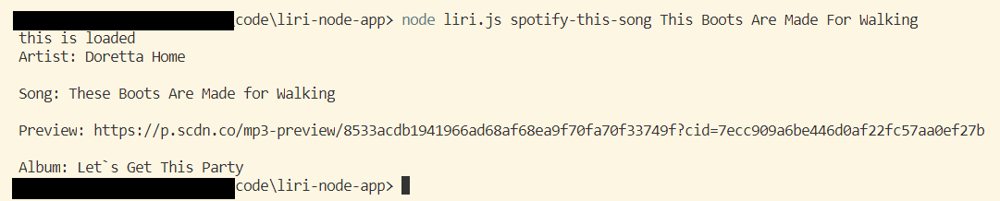
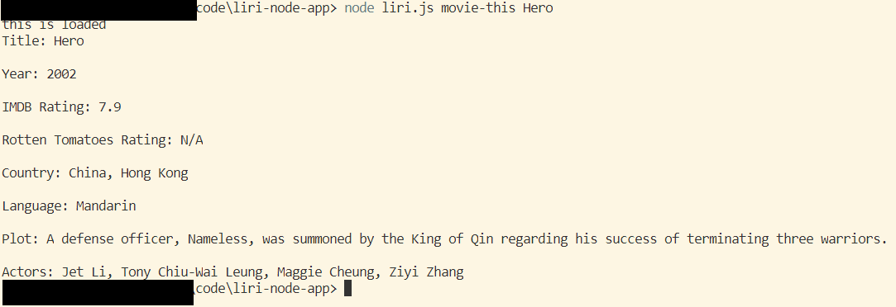
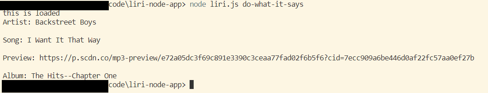

# liri-node-app
UW-Extension Coding Boot Camp Homework Week 10

Purpose: Learn to work with Node.js, npm packages, APis

Description:

Command line app that will search Spotify for songs, Bands in Town for concerts, and OMDB for movies. 

Will display search results in the terminal and will write it in log.txt file.

If you wish to clone and run it, you will have to create ".env" file with your own Spotify API keys.

Commands are: 

   * `concert-this` + name of the artist
   

   * `spotify-this-song` + name of the song
   

   * `movie-this` + name of the movie
   

   * `do-what-it-says` takes command from random.txt
   

See it alive: https://drive.google.com/file/d/1q01mAWQ6Cp_uJJL4i8sGoS7I9LbDUJw-/view?usp=sharing